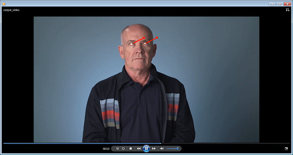

# Computer Pointer Controller

The goal in this project is to determine gaze direction of a person in the image, or video stream 
(from video file or camera), using Intel OpenVINO toolkit. As one of the applications of 
gaze detection, mouse pointer could be moved in the direction of the person's gaze.

At the core of the project is building a 'pipeline', i.e. series of neural networks that use 
one network's output as input to one or more other networks. 

Below is the design of the pipeline, using 4 networks from OpenVINO Model Zoo:
 
 

## Project Set Up and Installation
I used Ubuntu 18.04 on VirtualBox for this project. These were the preparation steps:
* Install OpenVINO Toolkit as described 
[here](https://docs.openvinotoolkit.org/latest/_docs_install_guides_installing_openvino_linux.html)
* Make OpenVINO variables available: `source /opt/intel/openvino/bin/setupvars.sh`
* Required dependencies installed via `pip install -r requirements.txt`
* Download all required models using OpenVINO model downloader and place under `models` sub-directory: 
    * `./downloader.py --name face-detection-adas-binary-0001 -o ~/Projects/mouse-pointer-controller/models/`
    * `./downloader.py --name head-pose-estimation-adas-0001 -o ~/Projects/mouse-pointer-controller/models/`
    * `./downloader.py --name landmarks-regression-retail-0009 -o ~/Projects/mouse-pointer-controller/models/`
    * `./downloader.py --name gaze-estimation-adas-0002 -o ~/Projects/mouse-pointer-controller/models/`
* Implement model loading and inference in python files:
    * `face_detection.py`
    * `head_pose_estimation.py`
    * `landmarks_regression.py`
    * `gaze_estimation.py`
* Implement feed iteration for single image and video stream in `input_feeder.py`
* Implement main logic putting pieces together in `main.py`

## Demo
Below id the example frame from a processed video file showing the detected gaze direction
of a person in the video (showing gaze vector projection, as an alternative to mouse moving):

 
 Video file `bin/demo_output.mp4` is included.

## Documentation
The `main.py` has the following parameters:
* `--type`: 'image', 'video' or 'cam'
* `--file`: image or video file
* `--quantize`: quantization parameter (FP32, FP16 or INT8), model of this type will 
be used where applicable, default: FP16
* `--precision`: optional, precision of mouse movement
* `--speed`: optional, speed of mouse movement

Precision and speed parameters can be left empty to omit mouse movement.
The pyautogui library does not support mouse control in Virtual environments like VirtualBox, 
so in order to check correctness, vector projections were drawn over the person's eyes.
In non-virtualized environments, the code should work correctly, moving the mouse pointer
in the direction of the person's gaze.

To run the demo on an image:

    python main.py --type image --file ../bin/demo.png

To run the demo on a video file to draw detected gaze vector projections:

    python main.py --type video --file ../bin/demo.mp4

To run the demo on a video file to additionally move the mouse pointer:

    python main.py --type video --file ../bin/demo.mp4 --precision high --speed fast

To run the demo on a cam video stream and move the mouse pointer:

    python main.py --type cam --precision high --speed fast
    
Note: add `--quantize` parameter to use quantized model of the given type: FP32, FP16, INT8 
(default: FP16) 
   

## Benchmarks
The tests were run on different quantization model types where applicable  
(all models except Face Detection were available in three precisions: FP32, FP16, INT8).
Unfortunately, the INT8 models caused python process to coredump during inference 
on VirtualBox Ubuntu 18.04, so comparison was made only between FP32 and FP16 precision types. 

| Name |  Loading FP32 |  Loading FP16 |  Loading Diff % |  Avg processing FP32 |  Avg processing FP16 |  Avg processing Diff % |  Avg inference FP32 |  Avg inference FP16 |  Avg inference Diff % |
|------|---------------|---------------|-----------------|----------------------|----------------------|------------------------|---------------------|---------------------|-----------------------|
| Face Detection |  0.258 |  - |  - |  0.0619 |  - |  - |  0.0602 |  - |  - |
| Facial Landmarks Detection |  0.0609 |  0.0513 |  -15.76% |  0.00127 |  0.00124 | -2.36% |  0.00109 |  0.00107 |  -1.83% |
| Head Pose Estimation |  0.0833 |  0.086 |  +3.24% |  0.00586 |  0.0057 |  -2.73% |  0.0056 |  0.00545 |  -2.68% |
| Gaze Estimation |  0.117 |  0.123 |  +5.13% |  0.00748 |  0.00738 |  -1.34% |  0.00723 |  0.00713 |  -1.38% |

## Results

As we can see, FP16 shows small gains in terms of average inference time per frame, 
approx. 1.3-2.7% faster. The gains are not significant since these are still floating 
point operations that are performed during inference.

We could also see that Face Detection model inference is taking an order of magnitude 
more time on inference than other models, ~60 ms per frame.

Also, inference time is taking over 97% of total processing time (inference plus pre- 
and post-processing). 

Taking all the above into account, the following conclusions can be drawn:

* Face Detection model is the bottleneck in this pipeline, 60 ms per frame 
means ~16 FPS processing rate for video stream, which could be acceptable in many cases.
If higher rate is required, either new hardware or other face detection model should be used.
* Pre- and post-processing are not a major optimization focus at this point
* Even though FP16 models take up less space, model loading time is significantly improved only 
for Facial Landmarks model, so loading time must be dependent on other factors as well 
(layer complexity etc.) 

### Async Inference
Even though async method was used for inference, the pipeline is not truly asynchronous,
i.e. processing continues to the next frame only after inference is completed.
Making this pipeline fully asynchronous would make sense only to account for short 
drops in performance (due to other processes taking up resources etc.), 
i.e. to implement buffering.

Otherwise, if the program cannot keep up with the rate, buffers will get full anyway,
thus not achieving the goal.

As stated above, the rate achieved on the given hardware was ~16 FPS, which can be considered
acceptable in many cases (human eye is ok when viewing video even with 10 FPS).

### Edge Cases
To avoid person detect/un-detect issue and having to play around with probability threshold,
the Face Detection model does not use threshold to select a face, it simply takes the
face with highest probability. This makes model more stable when a single person 
is in the view. 

With multiple people in the view the side-effect is that it may switch from person to person. 
To avoid this, some type of face tracking (e.g. centroid tracking) can be employed. 
